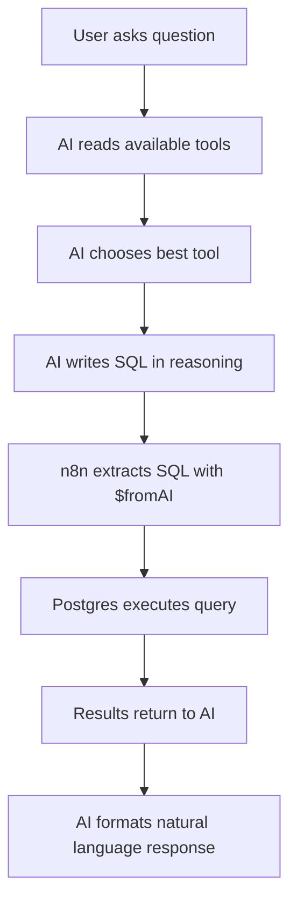

# AI Tools Guide: Postgres Query Tools

> **The magic that makes RAG work** - Teaching your AI to write SQL queries

## Table of Contents
1. [Overview](#overview)
2. [How Tools Work](#how-tools-work)
3. [The Three Tools](#the-three-tools)
4. [Adding Tools to Your Workflow](#adding-tools-to-your-workflow)
5. [The $fromAI() Pattern](#the-fromai-pattern)
6. [Example Conversations](#example-conversations)
7. [How AI Chooses Tools](#how-ai-chooses-tools)
8. [Troubleshooting](#troubleshooting)
9. [Advanced Patterns](#advanced-patterns)

---

## Overview

**What are AI Tools?**

In n8n's RAG (Retrieval-Augmented Generation) system, "tools" are capabilities you give to the AI agent. Each tool is a specialized node that the AI can choose to use when answering questions.

**Without tools:**
```
You: "Show me businesses in Phoenix"
AI: "I don't have access to query the database directly."
```

**With tools:**
```
You: "Show me businesses in Phoenix"
AI: [Thinks: I should use query_businesses tool]
    [Writes: SELECT business_name, rating FROM businesses WHERE city = 'Phoenix']
    [Executes: SQL query runs against Postgres]
    [Receives: 47 rows of data]
    [Responds: "I found 47 businesses in Phoenix! Here are the top 5..."]
```

**Why this matters:**

- AI writes SQL dynamically based on your question
- No need to pre-define every possible query
- AI learns your schema and gets better over time
- Natural language interface to your database

---

## How Tools Work

### The AI's Decision Process

When you ask a question, here's what happens behind the scenes:



**Example walkthrough:**

1. **You ask:** "Find high-rated coffee shops in Phoenix"

2. **AI reads tool descriptions:**
   - `query_businesses` - "Use this to search for businesses..."
   - `query_reviews` - "Use this to analyze customer reviews..."
   - `analyze_opportunities` - "Use this for complex analytical queries..."

3. **AI chooses:** `query_businesses` (best fit for filtering businesses)

4. **AI reasons:**
   ```
   The user wants coffee shops in Phoenix with high ratings.
   I should use the query_businesses tool.

   SQL query: SELECT business_name, rating, review_count
              FROM businesses
              WHERE city = 'Phoenix'
              AND category ILIKE '%coffee%'
              AND rating > 4.5
              ORDER BY rating DESC LIMIT 10
   ```

5. **n8n extracts SQL:** The `$fromAI('sql_query')` expression pulls the SQL from AI's thoughts

6. **Postgres executes:** Query runs against your database

7. **Results return:**
   ```json
   [
     {"business_name": "Desert Coffee Co", "rating": 4.9, "review_count": 127},
     {"business_name": "Phoenix Roasters", "rating": 4.8, "review_count": 89},
     ...
   ]
   ```

8. **AI responds:**
   ```
   I found 8 high-rated coffee shops in Phoenix! Here are the top 3:

   1. Desert Coffee Co - 4.9 stars (127 reviews)
   2. Phoenix Roasters - 4.8 stars (89 reviews)
   3. Copper Star Coffee - 4.7 stars (156 reviews)

   Would you like more details about any of these?
   ```

---

## The Three Tools

### Tool 1: Query Businesses

**Purpose:** Search and filter businesses by any criteria

**File:** `workflows/building-blocks/tool-query-businesses.json`

**When AI uses it:**
- "Show me businesses in [city]"
- "Find [category] businesses"
- "Which businesses have [attribute]?"
- "List businesses with [condition]"

**Key capabilities:**
- Filter by city, category, rating, review_count
- JSONB queries for nested data (social media, contact info, popular times)
- Aggregations (COUNT, AVG, SUM by category)
- Sorting and limiting results

**Schema highlights:**
```sql
-- Basic columns
business_name TEXT
city TEXT
category TEXT
rating DECIMAL
review_count INT
website TEXT
phone TEXT

-- JSONB nested data
business_data JSONB
  -> overview (city, category, rating)
  -> contact (phone, website, address, emails, lat/lng)
  -> social (Instagram, Facebook, LinkedIn, TikTok)
  -> rating (totalScore, reviewsCount, distribution, tags)
  -> popular_times (traffic histogram)
  -> tags (array)
```

**Example queries in tool description:**
- Basic city filter
- High-rated with low reviews (underserved markets)
- Businesses with Instagram accounts
- Category analysis with aggregations

### Tool 2: Query Reviews

**Purpose:** Analyze customer sentiment and find review patterns

**File:** `workflows/building-blocks/tool-query-reviews.json`

**When AI uses it:**
- "What are customers saying about [topic]?"
- "Find reviews mentioning [keyword]"
- "Analyze complaints for [category]"
- "What's the most common complaint?"

**Key capabilities:**
- Full-text search with Postgres `to_tsvector` and `to_tsquery`
- Sentiment analysis (filtering by stars)
- Pattern recognition (GROUP BY with string aggregation)
- Time-based filtering (recent reviews)
- Always joins with businesses table for context

**Schema highlights:**
```sql
-- Basic columns
business_id INT (foreign key)
reviewer_name TEXT
stars INT (1-5)
review_text TEXT (full-text searchable)
published_at DATE
review_data JSONB (complete review object)
```

**Full-text search operators:**
```sql
-- Find reviews with "parking"
to_tsvector('english', review_text) @@ to_tsquery('parking')

-- Both "parking" AND "problem"
to_tsvector('english', review_text) @@ to_tsquery('parking & problem')

-- Either "bad" OR "terrible"
to_tsvector('english', review_text) @@ to_tsquery('bad | terrible')

-- "coffee" but NOT "service"
to_tsvector('english', review_text) @@ to_tsquery('coffee & !service')

-- Words must be adjacent
to_tsvector('english', review_text) @@ to_tsquery('great <-> service')
```

**Example queries in tool description:**
- Keyword search with full-text
- Negative reviews for specific business
- Sentiment analysis by category
- Common complaint themes
- Recent positive reviews

### Tool 3: Analyze Opportunities

**Purpose:** Complex analytical queries for market insights

**File:** `workflows/building-blocks/tool-analyze-opportunities.json`

**When AI uses it:**
- "Find newsletter opportunities"
- "What are underserved markets?"
- "Analyze competitive landscape"
- "Find engagement gaps"
- "What categories have trust issues?"

**Key capabilities:**
- CTEs (WITH clauses) for multi-step analysis
- Statistical aggregations (AVG, SUM, COUNT with FILTER)
- Market opportunity formulas
- Competitive analysis (business vs market averages)
- Trend analysis across multiple executions

**Why separate from query_businesses:**

Different mental model:
- `query_businesses` = "Find me X"
- `analyze_opportunities` = "What patterns exist in X?"

Encourages analytical thinking:
- AI provides context and insights
- Not just raw data dumps
- Explains what numbers mean for newsletter opportunities

**Example analytical patterns:**

1. **Underserved markets:** High ratings + low competition
   ```sql
   WHERE rating > 4.5
   GROUP BY city, category
   HAVING COUNT(*) < 5 AND SUM(review_count) > 100
   ```

2. **Trust issues:** Many reviews + low ratings = need for curation
   ```sql
   GROUP BY category
   HAVING AVG(rating) < 4.0 AND SUM(review_count) > 500
   ```

3. **Engagement gaps:** High reviews + no social media
   ```sql
   WHERE rating > 4.5 AND review_count > 50
   AND business_data->'social'->>'instagrams' IS NULL
   ```

4. **Newsletter opportunity formula:**
   ```sql
   WITH category_stats AS (
     -- Calculate negative review percentage
     SELECT category,
       COUNT(*) as biz_count,
       AVG(rating) as avg_rating,
       COUNT(reviews) FILTER (WHERE stars <= 2) as negative_reviews,
       COUNT(reviews) as total_reviews
     FROM businesses JOIN business_reviews ...
   )
   SELECT *,
     ROUND(100.0 * negative_reviews / total_reviews, 1) as negative_pct
   WHERE biz_count > 5
   ORDER BY negative_pct DESC
   ```

---

## Adding Tools to Your Workflow

### Step-by-Step Integration

**Prerequisites:**
- Issue #3 completed (RAG chat interface exists)
- Database populated with business data
- n8n workflow open in editor

### Step 1: Import Tool Node

**Option A: From building-blocks JSON**
1. Download `tool-query-businesses.json`
2. In n8n, click "+" to add node
3. Search for "Postgres Tool"
4. Click "Actions" → "Import from JSON"
5. Paste tool JSON
6. Update credentials to your Postgres connection

**Option B: Create manually**
1. Add new node: "Postgres Tool"
2. Set operation: "Execute Query"
3. Set query: `={{ $fromAI('sql_query') }}`
4. Enable "Manual Description"
5. Copy toolDescription from JSON file
6. Save and name node

### Step 2: Connect to AI Agent

1. Locate your "RAG AI Agent" node (from Issue #3)
2. Drag connection from tool node to agent
3. When hovering, you'll see multiple ports:
   - `ai_languageModel` (for OpenAI model)
   - `ai_memory` (for chat memory)
   - `ai_tool` (for tools - **connect here**)
4. Drop connection on `ai_tool` port
5. Repeat for all 3 tools

**Visual check:** Your agent should have 5 connections:
- 1 → OpenAI Chat Model (ai_languageModel)
- 1 → Postgres Chat Memory (ai_memory)
- 3 → Tool nodes (ai_tool × 3)

### Step 3: Configure Tool Credentials

All three tools need Postgres credentials:

1. Click tool node
2. Click "Credentials" dropdown
3. Select existing "Market Research DB" or create new:
   - Host: Your Postgres/Supabase host
   - Database: Your database name
   - User: postgres
   - Password: Your password
   - Port: 5432 (default) or 6543 (Supabase)
   - SSL: Enable for Supabase

### Step 4: Update System Prompt (Optional)

If you want to guide AI behavior, update the agent's system prompt:

```
You are a market research analyst assistant with access to a database of local businesses and customer reviews.

You have three tools available:

1. **query_businesses** - Use for finding and filtering businesses
2. **query_reviews** - Use for analyzing customer sentiment and reviews
3. **analyze_opportunities** - Use for market analysis and newsletter ideas

When answering questions:
- Choose the most appropriate tool for the task
- Write clear, efficient SQL queries
- ALWAYS include business_name in SELECT statements
- Limit results to 50 rows unless asked for more
- Provide context with your analysis (don't just return numbers)
- If you find patterns, explain what they mean

For newsletter opportunities, look for:
- High review volume + low ratings = trust issues
- High ratings + low competition = underserved markets
- High reviews + no social media = engagement gaps
```

### Step 5: Save and Activate

1. Save workflow (Ctrl/Cmd + S)
2. Activate workflow (toggle in top right)
3. Ready to test!

---

## The $fromAI() Pattern

### What is $fromAI()?

**The magic expression that makes tools work:**

```javascript
query: "={{ $fromAI('sql_query') }}"
```

**What it does:**
1. AI writes SQL in its reasoning process
2. `$fromAI('sql_query')` extracts that SQL
3. n8n passes SQL to Postgres
4. Results return to AI

**Under the hood (AI's internal monologue):**

```
User asked: "Show me businesses in Phoenix"

I should use the query_businesses tool.

I'll write a SQL query to find businesses:
sql_query: SELECT business_name, rating, review_count
           FROM businesses
           WHERE city = 'Phoenix'
           ORDER BY rating DESC
           LIMIT 10

[n8n extracts this SQL and executes it]
```

### How AI Knows to Provide sql_query

**The tool description teaches the AI:**

```
toolDescription: "...Example queries:

SELECT business_name, category FROM businesses WHERE city = 'Phoenix';
..."
```

When AI sees SQL examples in the description, it learns to:
1. Write SQL in that format
2. Name it `sql_query` (because that's what `$fromAI('sql_query')` expects)
3. Include necessary columns and constraints

### Other Uses of $fromAI()

You can extract any parameter from AI reasoning:

```javascript
// Extract file_id
"={{ $fromAI('file_id') }}"

// Extract multiple parameters
"={{ $fromAI('city') }}" + " and " + "={{ $fromAI('category') }}"

// With default value
"={{ $fromAI('limit', 50) }}"
```

**Example: Multi-parameter tool**

```json
{
  "toolDescription": "Query businesses by city and category. Provide city and category parameters.",
  "query": "SELECT * FROM businesses WHERE city = '{{ $fromAI('city') }}' AND category = '{{ $fromAI('category') }}' LIMIT {{ $fromAI('limit', 10) }}"
}
```

AI would reason:
```
I need to provide:
city: Phoenix
category: Coffee Shop
limit: 20
```

### Security Note

**$fromAI() is safe because:**

1. **Read-only:** `postgresTool` only allows SELECT queries
2. **No DROP/DELETE:** AI cannot modify data
3. **No injection:** Postgres parameterized queries prevent SQL injection
4. **Timeout limits:** Long-running queries are killed

**What AI cannot do:**
```sql
-- ❌ These will be rejected
DROP TABLE businesses;
DELETE FROM businesses WHERE city = 'Phoenix';
UPDATE businesses SET rating = 5.0;
INSERT INTO businesses VALUES (...);
```

**What AI can do:**
```sql
-- ✅ All SELECT queries are allowed
SELECT * FROM businesses;
SELECT business_name FROM businesses WHERE city = 'Phoenix';
-- Even complex queries
WITH stats AS (...) SELECT ...;
```

---

## Example Conversations

### Example 1: Basic Business Lookup

**You:** Show me the top 5 businesses in Phoenix by rating

**AI reasoning (internal):**
```
User wants businesses in Phoenix, sorted by rating.
I'll use query_businesses tool.

sql_query: SELECT business_name, rating, review_count, category
           FROM businesses
           WHERE city = 'Phoenix'
           ORDER BY rating DESC
           LIMIT 5
```

**SQL executed:**
```sql
SELECT business_name, rating, review_count, category
FROM businesses
WHERE city = 'Phoenix'
ORDER BY rating DESC
LIMIT 5
```

**Results:**
```json
[
  {"business_name": "Desert Coffee Co", "rating": 4.9, "review_count": 127, "category": "Coffee Shop"},
  {"business_name": "Phoenix Auto Detail", "rating": 4.8, "review_count": 89, "category": "Auto Detailing"},
  ...
]
```

**AI response:**
```
Here are the top 5 businesses in Phoenix by rating:

1. **Desert Coffee Co** (Coffee Shop) - 4.9 stars (127 reviews)
2. **Phoenix Auto Detail** (Auto Detailing) - 4.8 stars (89 reviews)
3. **Copper Star Coffee** (Coffee Shop) - 4.7 stars (156 reviews)
4. **Valley Bike Repair** (Bicycle Shop) - 4.7 stars (94 reviews)
5. **Arizona Pet Grooming** (Pet Groomer) - 4.6 stars (203 reviews)

Would you like more details about any of these businesses?
```

### Example 2: Review Analysis

**You:** What are customers complaining about in auto repair shops?

**AI reasoning:**
```
User wants to analyze complaints in auto repair category.
I'll use query_reviews tool with full-text search for negative reviews.

sql_query: SELECT b.business_name, r.review_text, r.stars
           FROM business_reviews r
           JOIN businesses b ON b.id = r.business_id
           WHERE b.category ILIKE '%auto repair%'
           AND r.stars <= 2
           ORDER BY r.published_at DESC
           LIMIT 30
```

**SQL executed:** (AI's query)

**Results:** 28 negative reviews returned

**AI response:**
```
I analyzed 28 negative reviews from auto repair shops. Here are the main complaint themes:

**Top Complaints:**

1. **Overcharging / Price Surprises** (34% of complaints)
   - "They quoted $300 but charged $850"
   - "Added services I never approved"
   - "Price was double the estimate"

2. **Unnecessary Repairs** (28% of complaints)
   - "Said I needed new brakes, but they were fine"
   - "Recommended $2000 in repairs for a simple fix"

3. **Poor Communication** (21% of complaints)
   - "Never called to update me"
   - "Couldn't explain what they did"
   - "Rude when I asked questions"

4. **Work Quality Issues** (17% of complaints)
   - "Problem came back after 2 weeks"
   - "Made it worse"
   - "Had to take it somewhere else to fix their fix"

**Newsletter Opportunity:** "Phoenix Auto Honesty Report - Shops You Can Trust"

Would you like me to find the highest-rated auto repair shops as alternatives?
```

### Example 3: Market Opportunity Analysis

**You:** What are the best newsletter opportunities in this data?

**AI reasoning:**
```
User wants newsletter opportunities - analytical query.
I'll use analyze_opportunities tool with CTE for complex analysis.

sql_query: WITH category_stats AS (
  SELECT b.category,
    COUNT(*) as biz_count,
    AVG(b.rating) as avg_rating,
    COUNT(r.id) FILTER (WHERE r.stars <= 2) as negative_reviews,
    COUNT(r.id) as total_reviews,
    SUM(b.review_count) as market_review_volume
  FROM businesses b
  LEFT JOIN business_reviews r ON r.business_id = b.id
  GROUP BY b.category
)
SELECT category, biz_count,
  ROUND(avg_rating, 2) as avg_rating,
  negative_reviews,
  total_reviews,
  ROUND(100.0 * negative_reviews / NULLIF(total_reviews, 0), 1) as negative_pct,
  market_review_volume
FROM category_stats
WHERE biz_count > 5
ORDER BY negative_pct DESC, market_review_volume DESC
LIMIT 10
```

**SQL executed:** (AI's CTE query)

**Results:** Analytical aggregations returned

**AI response:**
```
Based on my analysis, I found 3 strong newsletter opportunities:

## 1. Auto Repair (Highest Potential)
- **Market size:** 52 businesses in Phoenix
- **Average rating:** 3.9 stars (below 4.0 threshold)
- **Total reviews:** 6,234 (high engagement = people searching for recommendations)
- **Negative review rate:** 34%
- **Common complaints:** Overcharging, unnecessary repairs, poor communication

**Newsletter concept:** "Phoenix Auto Honesty Report"
- Weekly: Feature trustworthy shops
- Monthly: Expose pricing trends and red flags
- Monetization: Featured listings from verified shops

## 2. Home Services (Good Potential)
- **Market size:** 87 businesses (plumbers, electricians, HVAC)
- **Average rating:** 4.3 stars (room for improvement)
- **Total reviews:** 12,453 (VERY high engagement)
- **Negative review rate:** 21%
- **Common issues:** Communication breakdowns, pricing surprises

**Newsletter concept:** "Phoenix Home Pros - Transparent Recommendations"
- Bi-weekly: Vetted contractor recommendations
- Emergency contact lists
- Pricing benchmarks for common jobs

## 3. Pet Services (Emerging Opportunity)
- **Market size:** Only 23 businesses (underserved!)
- **Average rating:** 4.6 stars (quality is good)
- **Total reviews:** 1,842 (demand exists, supply limited)
- **Negative review rate:** 8% (low, but people searching)

**Newsletter concept:** "Phoenix Pet Care Insider"
- Weekly: New services, boarding availability
- Monthly: Pet event calendar
- Partner with local vets for content

**Recommendation:** Start with Auto Repair (highest pain point + volume). Home Services is a close second with even higher volume but less urgent trust issues.

Would you like me to dive deeper into any of these categories?
```

### Example 4: Follow-Up Questions (Memory)

**Conversation demonstrating context retention:**

```
You: "Show me auto repair shops in Phoenix"

AI: [Uses query_businesses]
    "I found 52 auto repair shops in Phoenix. Here are the top 10 by rating..."

You: "Which of these have the worst reviews?"

AI: [Remembers context: "these" = Phoenix auto repair shops]
    [Uses query_reviews with business_id IN (...)]
    "Among those shops, here are the 5 with lowest ratings and most complaints..."

You: "What's the most common complaint?"

AI: [Remembers: we're talking about worst-rated auto shops]
    [Uses query_reviews with pattern analysis]
    "The most common complaint is overcharging, appearing in 34% of negative reviews.
     Specifically, customers mention:
     - Estimates doubled at payment (12 reviews)
     - Unauthorized additional work (9 reviews)
     - Hidden fees not disclosed upfront (6 reviews)"

You: "Find me alternatives with good pricing transparency"

AI: [Remembers: still in auto repair context, looking for opposite of overcharging]
    [Uses query_reviews with full-text search for "transparent" OR "honest"]
    [Then joins to businesses table]
    "Here are 3 shops frequently praised for pricing transparency:
     1. Honest Abe's Auto - 4.8 stars, 12 reviews mention 'upfront pricing'
     2. Clear Quote Auto - 4.7 stars, 9 reviews mention 'no surprises'
     3. Valley Transparency Motors - 4.6 stars, 8 reviews mention 'detailed estimates'"
```

**What makes this powerful:**
- AI remembers full conversation context
- "These", "that", "the most common" all reference previous queries
- AI chains multiple tools (businesses → reviews → businesses again)
- Provides progressively deeper insights

---

## How AI Chooses Tools

### Decision-Making Process

**The AI reads all tool descriptions and picks the best match.**

**Comparison chart:**

| User Question | AI Chooses | Reasoning |
|--------------|-----------|-----------|
| "Show me businesses in Phoenix" | `query_businesses` | Filtering businesses by city |
| "Find coffee shops" | `query_businesses` | Category filter |
| "What are customers saying about parking?" | `query_reviews` | Analyzing review content |
| "Find businesses with Instagram" | `query_businesses` | JSONB attribute query |
| "What are the best newsletter opportunities?" | `analyze_opportunities` | Market analysis |
| "Which category has the worst ratings?" | `analyze_opportunities` | Aggregation analysis |
| "Find negative reviews for [business]" | `query_reviews` | Review sentiment |
| "Compare Phoenix vs Seattle markets" | `analyze_opportunities` | Multi-city comparison |

### Tool Description Best Practices

**What makes a good tool description:**

1. **Clear purpose statement**
   ```
   ✅ "Use this tool to search for businesses by city, category, or attributes"
   ❌ "Query the businesses table"
   ```

2. **Schema documentation**
   ```
   ✅ "Table schema:
       - business_name (TEXT)
       - city (TEXT) - Examples: 'Phoenix', 'Seattle'
       - rating (DECIMAL) - Range: 1.0 to 5.0"
   ❌ "Has columns for business data"
   ```

3. **Example queries**
   ```
   ✅ "Example: SELECT business_name, rating FROM businesses WHERE city = 'Phoenix'"
   ❌ "You can query businesses"
   ```

4. **Use cases**
   ```
   ✅ "Use this tool when user asks:
       - 'Show me businesses in [city]'
       - 'Find [category] businesses'"
   ❌ "Use for business queries"
   ```

5. **Edge case guidance**
   ```
   ✅ "ALWAYS include business_name in SELECT. Limit results to 50 rows."
   ❌ "Return results"
   ```

### When AI Chooses Wrong Tool

**Scenario:** You ask "What categories exist in Phoenix?" but AI uses `query_reviews` instead of `query_businesses`

**Why it happened:**
- Tool descriptions weren't distinct enough
- Both mentioned "category"
- AI guessed wrong

**How to fix:**

1. **In the moment:** Guide the AI
   ```
   "Use the query_businesses tool to SELECT DISTINCT category FROM businesses WHERE city = 'Phoenix'"
   ```

2. **Long-term:** Update tool descriptions
   ```diff
   query_businesses description:
   + "Use this tool for finding businesses and their attributes (name, city, category, rating)"

   query_reviews description:
   + "Use this tool for analyzing customer review content and sentiment (NOT for business attributes)"
   ```

3. **System prompt:** Add tool selection guidance
   ```
   When user asks about businesses themselves (names, locations, ratings), use query_businesses.
   When user asks about customer opinions (reviews, complaints, praise), use query_reviews.
   When user asks about market patterns or opportunities, use analyze_opportunities.
   ```

---

## Troubleshooting

### Issue: "AI says 'I cannot execute queries'"

**Symptoms:**
```
You: "Show me businesses in Phoenix"
AI: "I don't have direct access to query the database."
```

**Diagnosis:** Tools not connected properly

**Solutions:**

1. **Check tool connections**
   - Open workflow in n8n
   - Click AI Agent node
   - Count incoming connections (should see 5 lines)
   - Each tool should connect to `ai_tool` port (NOT main port)

2. **Verify tool type**
   - Click each tool node
   - Check node type: Should be `n8n-nodes-base.postgresTool`
   - If it says `n8n-nodes-base.postgres`, that's wrong - delete and recreate as Postgres Tool

3. **Check workflow activation**
   - Top right toggle should be ON (green)
   - If off, click to activate

4. **Test individual tool**
   - Disconnect all but one tool
   - Ask question specific to that tool
   - If works: reconnect others
   - If fails: tool configuration issue

### Issue: "AI returns SQL syntax errors"

**Symptoms:**
```
AI: "I attempted to query the database but received an error:
     ERROR: column 'bussiness_name' does not exist"
```

**Diagnosis:** AI wrote invalid SQL (typo, wrong column name, etc.)

**Solutions:**

1. **Provide correct query** (teaches AI for future)
   ```
   "Try again with: SELECT business_name (not bussiness_name) FROM businesses WHERE city = 'Phoenix'"
   ```

2. **Check tool description accuracy**
   - Open tool JSON
   - Verify column names match your actual schema
   - Run test query in Supabase SQL editor:
     ```sql
     SELECT column_name FROM information_schema.columns WHERE table_name = 'businesses';
     ```
   - Update tool description if schema changed

3. **Upgrade model** (if persistent)
   - Open AI Agent node
   - Change model from `gpt-4o-mini` to `gpt-4o`
   - gpt-4o is significantly better at SQL

4. **Add schema enforcement**
   - In system prompt:
     ```
     When writing SQL:
     - ALWAYS use business_name (not name or business)
     - ALWAYS use city (not location or place)
     - ALWAYS use category (not type or business_type)
     ```

### Issue: "AI uses wrong tool for question"

**Symptoms:**
```
You: "How many businesses are in Phoenix?"
AI: [Uses query_reviews instead of query_businesses]
    "ERROR: column 'city' does not exist in business_reviews"
```

**Diagnosis:** Tool descriptions too similar or unclear

**Solutions:**

1. **Clarify tool purposes** in descriptions
   ```diff
   query_businesses:
   + "Use this tool when user asks about BUSINESS ATTRIBUTES: names, locations, ratings, contact info"

   query_reviews:
   + "Use this tool when user asks about CUSTOMER OPINIONS: review content, complaints, praise, sentiment"
   ```

2. **Add negative examples**
   ```
   query_reviews description:
   + "DO NOT use this tool for:
      - Counting businesses (use query_businesses)
      - Finding business locations (use query_businesses)
      - Business contact info (use query_businesses)"
   ```

3. **Update system prompt**
   ```
   Tool selection rules:
   - query_businesses: Business attributes (WHERE city = ...)
   - query_reviews: Review content (WHERE review_text LIKE ...)
   - analyze_opportunities: Aggregations (GROUP BY, statistical analysis)
   ```

### Issue: "Results are truncated at 50 rows"

**Symptoms:**
```
You: "Show me ALL businesses in Phoenix"
AI: "I found 47 businesses in Phoenix. Here are the first 50..."
```

**Diagnosis:** LIMIT 50 in query (by design, but user wants more)

**Solutions:**

1. **Ask explicitly**
   ```
   "Show me all 200+ businesses in Phoenix without any LIMIT"
   ```
   AI will remove LIMIT clause

2. **Request aggregation instead**
   ```
   "How many businesses in each category in Phoenix?"
   ```
   Gets same info in manageable format

3. **Increase limit in tool description**
   ```diff
   - "Return maximum 50 rows unless specifically asked for more."
   + "Return maximum 100 rows unless specifically asked for more."
   ```

### Issue: "AI doesn't use JSONB queries"

**Symptoms:**
```
You: "Find businesses with Instagram accounts"
AI: "I don't have access to social media information"
```

**Diagnosis:** AI doesn't understand JSONB structure

**Solutions:**

1. **Provide example query**
   ```
   "Query the business_data JSONB column:
    SELECT business_name, business_data->'social'->>'instagrams' as instagram
    FROM businesses
    WHERE business_data->'social' ? 'instagrams'"
   ```

2. **Verify JSONB in tool description**
   - Should include examples like:
     ```sql
     business_data->'social'->>'instagrams'
     business_data->'contact'->>'emails'
     business_data->'rating'->>'totalScore'
     ```

3. **Check actual data structure**
   - Run in Supabase:
     ```sql
     SELECT business_data FROM businesses LIMIT 1;
     ```
   - Verify keys match tool description
   - Update description if structure different

### Issue: "Queries are slow (> 10 seconds)"

**Symptoms:**
```
You: "Find businesses in Phoenix"
[Loading... 12 seconds]
AI: "I found 47 businesses..."
```

**Diagnosis:** Missing database indexes

**Solutions:**

1. **Check indexes exist**
   ```sql
   SELECT indexname FROM pg_indexes WHERE tablename = 'businesses';
   ```
   Should see ~10 indexes (city, category, rating, etc.)

2. **Create missing indexes** (from Issue #1)
   ```sql
   CREATE INDEX idx_businesses_city ON businesses(city);
   CREATE INDEX idx_businesses_category ON businesses(category);
   CREATE INDEX idx_businesses_rating ON businesses(rating);
   CREATE INDEX idx_businesses_review_count ON businesses(review_count);
   -- Full-text search
   CREATE INDEX idx_reviews_fts ON business_reviews USING GIN(to_tsvector('english', review_text));
   ```

3. **Optimize JSONB queries**
   ```sql
   CREATE INDEX idx_businesses_jsonb_social ON businesses USING GIN((business_data->'social'));
   ```

4. **Check query plan**
   ```sql
   EXPLAIN ANALYZE
   SELECT * FROM businesses WHERE city = 'Phoenix';
   ```
   Should show "Index Scan" (not "Seq Scan")

---

## Advanced Patterns

### Pattern 1: Tool Chaining

**AI automatically chains multiple tools to answer complex questions:**

**Question:** "Which Phoenix coffee shops have the best customer service reviews?"

**AI's approach:**
1. Use `query_businesses` to get Phoenix coffee shops
2. Use `query_reviews` to analyze reviews for those specific businesses
3. Filter for reviews mentioning "service", "staff", "friendly"
4. Aggregate and rank

**SQL sequence:**
```sql
-- Step 1: Get coffee shop IDs
SELECT id, business_name FROM businesses
WHERE city = 'Phoenix' AND category ILIKE '%coffee%';

-- Step 2: Analyze service reviews
SELECT b.business_name,
  COUNT(*) as service_mentions,
  AVG(r.stars) as avg_service_rating
FROM business_reviews r
JOIN businesses b ON b.id = r.business_id
WHERE r.business_id IN (1, 2, 3, ...) -- IDs from step 1
AND to_tsvector('english', r.review_text) @@ to_tsquery('service | staff | friendly')
GROUP BY b.business_name
ORDER BY avg_service_rating DESC;
```

### Pattern 2: Progressive Refinement

**AI refines queries based on your feedback:**

```
You: "Find businesses in Phoenix"
AI: [Returns 200+ businesses]

You: "Too many. Just auto repair shops"
AI: [Adds WHERE category ILIKE '%auto repair%']

You: "With good ratings"
AI: [Adds AND rating > 4.5]

You: "That have Instagram"
AI: [Adds AND business_data->'social' ? 'instagrams']

Final query: Highly specific, built incrementally
```

### Pattern 3: Cross-Tool Analysis

**Combining data from all three tools:**

**Question:** "Which underserved market has the highest complaint rate?"

**AI's approach:**
1. `analyze_opportunities` to find underserved markets (high demand, low supply)
2. `query_reviews` to calculate complaint rates for those markets
3. Cross-reference and rank

**SQL:**
```sql
-- Step 1: Underserved markets
WITH underserved AS (
  SELECT city, category, COUNT(*) as biz_count, SUM(review_count) as demand
  FROM businesses
  GROUP BY city, category
  HAVING COUNT(*) < 5 AND SUM(review_count) > 100
)
-- Step 2: Complaint rates
SELECT u.city, u.category, u.biz_count, u.demand,
  COUNT(r.id) FILTER (WHERE r.stars <= 2) as complaints,
  ROUND(100.0 * COUNT(r.id) FILTER (WHERE r.stars <= 2) / COUNT(r.id), 1) as complaint_pct
FROM underserved u
JOIN businesses b ON b.city = u.city AND b.category = u.category
LEFT JOIN business_reviews r ON r.business_id = b.id
GROUP BY u.city, u.category, u.biz_count, u.demand
ORDER BY complaint_pct DESC;
```

### Pattern 4: Time-Series Analysis

**If you have multiple market_executions:**

**Question:** "How has the Phoenix coffee shop market changed over the past 3 months?"

**SQL:**
```sql
SELECT
  e.created_at::date as execution_date,
  COUNT(b.id) as coffee_shops_found,
  AVG(b.rating) as avg_rating,
  SUM(b.review_count) as total_reviews
FROM market_executions e
JOIN businesses b ON b.execution_id = e.id
WHERE e.search_query ILIKE '%coffee%'
AND e.search_query ILIKE '%Phoenix%'
AND e.created_at > CURRENT_DATE - INTERVAL '90 days'
GROUP BY e.created_at::date
ORDER BY e.created_at DESC;
```

**AI interprets trends:**
```
"The Phoenix coffee shop market has grown:
- Oct 11: 23 shops, 4.3 avg rating
- Sep 15: 21 shops, 4.2 avg rating
- Aug 20: 19 shops, 4.1 avg rating

Trend: Market expanding with quality improving.
Newsletter angle: 'New Phoenix Coffee Scene - 4 Shops to Try'"
```

### Pattern 5: Custom Metrics

**Teaching AI your business formulas:**

**In system prompt:**
```
Newsletter Opportunity Score Formula:
(negative_review_pct * review_volume * (1 / business_count)) / 100

High score = good opportunity because:
- High negative reviews = need for curation
- High volume = demand exists
- Low business count = underserved

When user asks for newsletter opportunities, calculate this score.
```

**AI will then write:**
```sql
WITH scores AS (
  SELECT
    category,
    COUNT(*) as biz_count,
    SUM(review_count) as review_volume,
    AVG(rating) as avg_rating,
    COUNT(reviews.id) FILTER (WHERE stars <= 2) as negative_reviews,
    (COUNT(reviews.id) FILTER (WHERE stars <= 2)::DECIMAL / COUNT(reviews.id) * 100) as negative_pct
  FROM businesses
  LEFT JOIN business_reviews reviews ON reviews.business_id = businesses.id
  GROUP BY category
)
SELECT category,
  ROUND((negative_pct * review_volume * (1.0 / biz_count)) / 100, 2) as opportunity_score,
  biz_count, review_volume, ROUND(avg_rating, 2) as avg_rating, negative_pct
FROM scores
WHERE biz_count > 5
ORDER BY opportunity_score DESC;
```

---

## Next Steps

**You've now:**
- ✅ Created 3 Postgres Tool nodes
- ✅ Understood the `$fromAI()` pattern
- ✅ Learned how AI chooses tools
- ✅ Seen example conversations
- ✅ Know how to troubleshoot

**What to do next:**

1. **Test extensively**
   - Try all example questions
   - Push the AI to chain tools
   - See how memory works across conversation

2. **Customize for your use case**
   - Add business-specific metrics to tool descriptions
   - Update system prompt with your newsletter criteria
   - Add custom analytical queries

3. **Monitor and improve**
   - Note which questions AI struggles with
   - Update tool descriptions with those patterns
   - Share successful queries back to AI in conversation

4. **Move to Issue #5**
   - Comprehensive testing
   - Performance optimization
   - Production readiness

---

## Additional Resources

- **Cole Medin's original template:** [n8n Community](https://n8n.io/workflows/)
- **Postgres full-text search:** [Official Docs](https://www.postgresql.org/docs/current/textsearch.html)
- **JSONB operators:** [PostgreSQL JSON Functions](https://www.postgresql.org/docs/current/functions-json.html)
- **n8n AI Agents:** [LangChain Integration Docs](https://docs.n8n.io/integrations/builtin/cluster-nodes/root-nodes/n8n-nodes-langchain.agent/)
- **Postgres Tool node:** [n8n Tool Documentation](https://docs.n8n.io/integrations/builtin/cluster-nodes/sub-nodes/n8n-nodes-langchain.toolpostgres/)

---

**Built with:** n8n • Postgres • OpenAI • Cole Medin's RAG pattern
